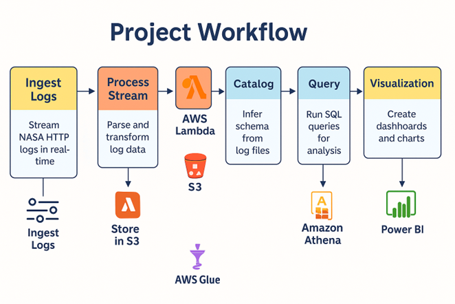

# Real-Time Website Traffic Analytics Using Distributed and Scalable AWS Cloud Services

## 📚 Project Summary

This project implements a real-time data engineering pipeline designed to simulate and analyze website traffic logs using cloud-native technologies. Inspired by real-world software engineering practices, the pipeline demonstrates how log analysis can provide operational intelligence to support the Software Development Life Cycle (SDLC).

Using NASA’s [HTTP Web Server Logs](https://ita.ee.lbl.gov/html/contrib/NASA-HTTP.html) as the primary dataset, the project ingests, processes, stores, and analyzes high-velocity web traffic data in real-time. AWS services such as Kinesis, Lambda, S3, Glue, and Athena form the backbone of the pipeline, with Power BI used for visualizing key insights like traffic trends, top URLs, and system health metrics.

The end-to-end distributed architecture showcases scalable, fault-tolerant design patterns, emphasizing the importance of serverless cloud computing in modern data engineering workflows.

---

## ⚙️ Technologies and Tools Used

- **AWS Kinesis** - Real-time data ingestion and streaming
- **AWS Lambda** - Serverless data processing
- **Amazon S3** - Scalable data storage
- **AWS Glue** - Schema detection and cataloging
- **Amazon Athena** - SQL-based querying of structured data
- **Power BI** - Interactive data visualization
- **Python** - Data parsing and streaming scripts
- **Boto3 SDK** - AWS service integration from Python
- **GitHub** - Code version control and collaboration

---

## 📈 Project Workflow Diagram

*Figure: End-to-end data pipeline from ingestion to visualization.*

---

## 🧩 Key Features

- Real-time ingestion of web server logs
- Serverless and scalable architecture
- Structured data storage and schema generation
- Interactive SQL querying and analysis
- Professional data visualizations using Power BI
- Designed for operational monitoring and system optimization

---

## 🧠 Team Members and Roles

- **Hrishabh** (Team Leader, Project Manager & Data Engineer)  
- **Yaminipoojitha** (Data Ingestion and Processing Engineer)  
- **Sahil** (Data Analyst and Visualization Specialist)

---

## 🚀 How to Run

1. Download the dataset: [NASA HTTP Web Server Logs](https://ita.ee.lbl.gov/html/contrib/NASA-HTTP.html)
2. Set up AWS services (Kinesis, S3, Lambda, Glue, Athena)
3. Stream the parsed NASA log data using the Python script
4. Process and store records in S3 using Lambda
5. Use Glue crawler to catalog the S3 data
6. Query the dataset via Athena
7. Visualize insights using Power BI

---
